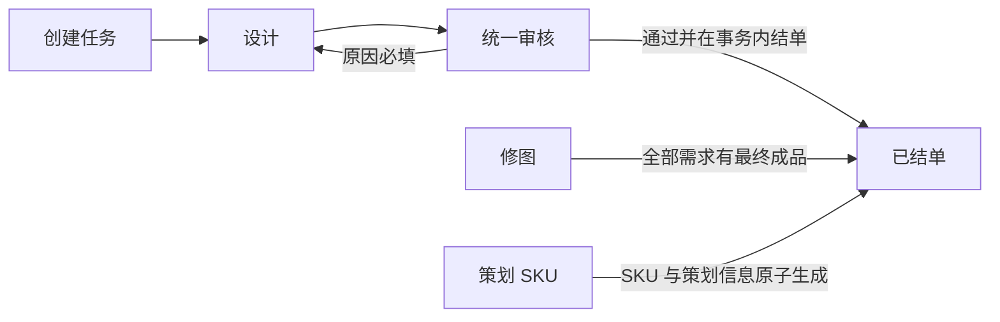

# V8 模块与工作流架构

> 状态：V8 当前完整替换版。本文只描述活动模型；历史状态和历史表仅供迁移工具读取。

## 1. 主流程



普通与定制共用同一个主状态机。定制制作和效果确认只能作为设计节点内部 job，
不得创建新的任务主状态。活动任务状态固定为：

`Draft | PendingAssign | Assigned | InProgress | PendingAudit | Completed | Archived | Cancelled | Blocked`

## 2. 显式权限

权限的唯一权威为：

- `auth_permissions`：代码维护的能力目录。
- `auth_roles`：管理员维护的业务角色。
- `auth_role_permissions`：角色能力矩阵。
- `auth_user_role_assignments`：用户角色及范围模式。
- `auth_assignment_scope_subjects`：`department|team + stable id`。
- `auth_org_role_policies`：管理员显式启用的组织默认策略。
- `auth_policy_state` 与 `auth_policy_events`：CAS 版本和审计。

范围模式只有 `self | own_department | own_team | selected_org | global`。组织名称不可参与
授权判断。新用户默认只有受保护的 `Member`；`SuperAdmin` 同样受保护。组织默认策略默认关闭。

所有策略写入必须包含 `reason + expected_policy_revision`。角色自身变更还必须包含
`expected_version`。冲突返回 409。禁止自我提权、越权授予和删除最后一个 SuperAdmin。

任务动作的唯一公式：

```text
allowed_actions = 有效能力 ∩ 稳定 ID 数据范围 ∩ 当前状态规则
```

前端不得从角色名、部门名或状态自行推断动作。

## 3. 工作流写入合同

### 3.1 设计提交

`POST /v1/tasks/{id}/submit-design` 必须提交任务全部范围组：

- 每组包含 `expected_group_lock_version`。
- 设计类任务每组恰有一份源文件。
- `single` 恰有一张最终成品。
- `set` 至少两张最终成品，顺序连续且完整。
- 一个任务内不同 SKU 可以混用两种模式。
- 所有文件必须是同任务、同范围、同角色且由有权用户暂存的文件。
- 请求使用 `expected_workflow_revision + idempotency_key`。

任一组失败则整单回滚；成功后状态为 `PendingAudit`。上传完成本身不推进任务。

### 3.2 统一审核

`POST /v1/tasks/{id}/audit/decision` 只有两个 decision：

- `approve`：继承提交资源，或按组完整替换源文件、模式和最终成品；随后在同一事务结单。
- `return_to_design`：原因必填，回到 `InProgress`，保留处理人并建立新的 working draft。

审核不上传新源文件时继承设计源文件；上传后新源文件成为唯一有效源。套装不允许部分覆盖。

### 3.3 Reopen

`POST /v1/tasks/{id}/reopen` 要求 `task.reopen`、原因和 workflow CAS：

- 设计类任务目标为 `design|audit`。
- 修图任务目标为 `retouch`。
- 策划 SKU 使用受控修正，不允许 reopen。

reopen 到审核时克隆新的 submitted revision；既有 finalized revision 在再次审核通过前继续
服务资产中心和已经固定的客户发布。

## 4. TaskFinalizer

`TaskFinalizer.FinalizeInTx` 必须使用调用方事务，禁止内部开启第二事务。

模式：

- `design_audit`：每个范围组都必须有可 finalize 的完整 revision。
- `retouch`：每条修图需求必须有最终成品，源文件可空。
- `sku_planning`：允许零资源组。

统一动作：workflow CAS、group lock CAS、切 finalized 指针、关闭活动模块和处理人、写完成
事件、写 ERP/search outbox。API 返回时任务已经是 `Completed`。异步失败不得重新打开任务。

## 5. 策划 SKU

`sku_planning` 一单包含 1-200 个 SKU，复用 `task_sku_items` 作为唯一身份表。创建事务：

1. 校验全部业务字段和暂存图片。
2. 校验可选 ERP 条件字段。
3. 锁定唯一启用的规则修订并原子分配完整编号区间。
4. 写任务、SKU 身份、详情和首个不可变修订。
5. 绑定每行至多一张产品图片。
6. 通过 `TaskFinalizer(mode=sku_planning)` 结单。
7. 按 SKU 写可选 ERP outbox。

字段规则：描述规格 1-4000 字、数量为正整数、目标价为可选 CNY 定点小数字符串、备注最多
2000 字、参考链接只接受 HTTP/HTTPS 且后端不抓取。SKU 编号不可修改。

结单后修正要求 `planning_sku.edit + reason + expected_version`，每次创建不可变修订。
ERP 已成功同步的记录只允许显式重同步。

## 6. 编号引擎

`code_rules` 指向当前启用的 `code_rule_revisions`；计数存放在 revision-scoped sequence。
规则段只允许固定前缀、日期、可选分类维度、分隔符和原子流水号。预览不消耗编号。
没有唯一启用的 `sku_planning` 规则时返回 `SKU_RULE_NOT_CONFIGURED`。

## 7. 异步投影

`task_erp_outbox` 统一承载 task filing、图片同步和策划 SKU sync/resync，包含 dedupe key、
lease、attempt、next_retry_at、last_error 和告警状态。`search_reindex_outbox` 承载搜索重建。
所有消费者必须幂等；单个 SKU 的失败不影响其他 SKU 或任务完成状态。

## 8. 迁移与切换

迁移工具只自动转换确定关系；任何范围、源文件、成品顺序或授权不明确的数据进入人工清单。
采用演练库与短维护窗口，不保持两套业务权威。切换后资源组指针和显式权限表立即成为唯一权威。

观察期内只读保留迁移证据；观察期通过后才执行物理清理。生产切换和清理都需要独立操作授权。
