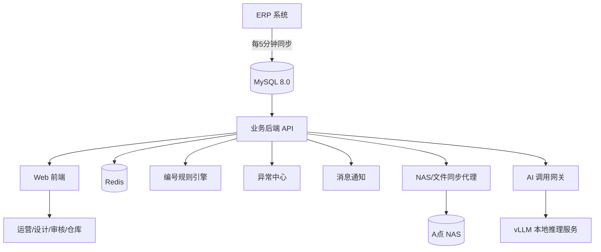
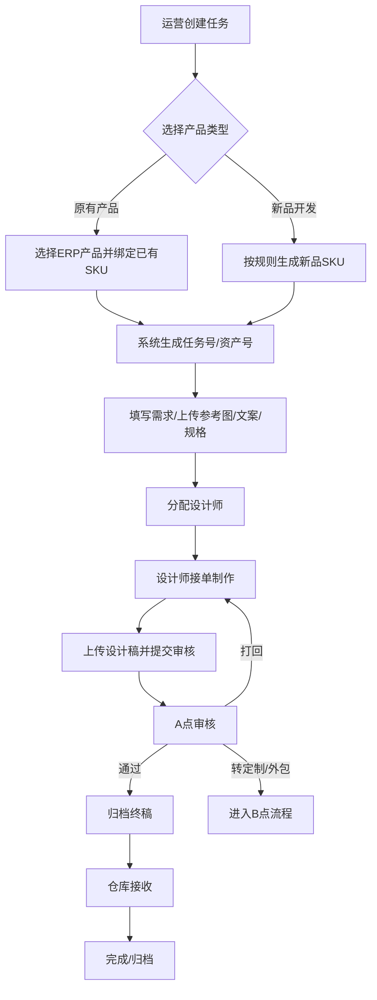
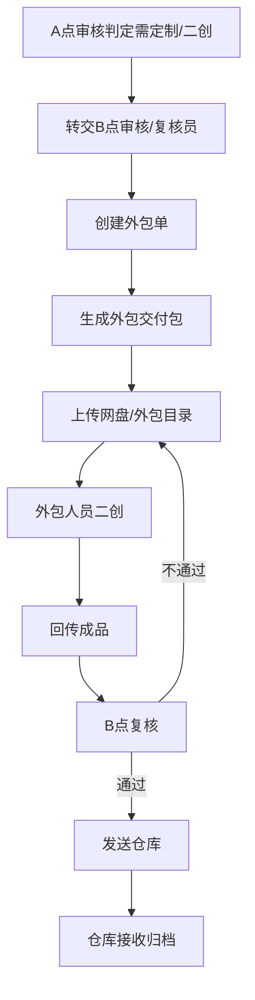
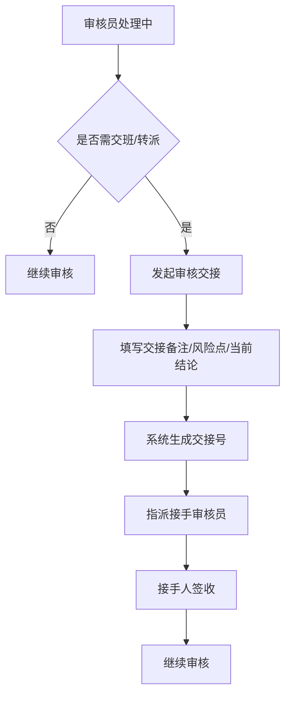

# 设计流转自动化管理系统 V7.0 技术实施规格（重构版）

> 适用范围：A 点总部、B 点复核/定制协作点、C 点仓库。
> 
> 本文档为可直接交付开发团队的正式实施规格，覆盖：ERP 主数据接入、工单管理、设计资产管理、审核流转、审核交班、定制/外包协作、仓库接收、编号规则、文件归档、通知与 AI 辅助能力。
> 
> 本文档替代 V6.0 中以“SKU/版本/分发执行”为主线的结构，改为以“任务单驱动业务流转”为主线；V6.0 中成熟的版本原子化、CAS 审核、Attempt/Lease/Heartbeat、Evidence、EventLog 等机制保留为底层执行能力。

# ARCHIVE ONLY
#
# NOT SOURCE OF TRUTH
# DO NOT USE FOR NEW INTEGRATION OR CURRENT SPEC DECISIONS
# SEE `docs/V0_9_MODEL_HANDOFF_MANIFEST.md`
# SEE `docs/V0_9_BACKEND_SOURCE_OF_TRUTH.md`

---

## 0. 文档目标

### 0.1 建设目标
本系统用于统一管理公司从产品设计需求发起，到设计制作、审核确认、定制/外包二创、仓库接收、资产归档的全流程，解决以下问题：

1. 需求入口不统一，长期依赖表格、截图、私聊、企业微信。
2. SKU 及产品信息补录滞后，造成仓库或后续环节缺码、缺资料。
3. 设计版本、审核意见、终稿文件、外包回传资料分散，难以追溯。
4. A/B 两地审核员存在交班与转派，但当前无标准机制。
5. 定制类产品存在 B 点复核与外包协作，但未形成正式系统闭环。
6. NAS、本地 AI、云服务器等已有资源未形成合理分工。

### 0.2 总体原则
系统必须满足以下原则：

- **ERP 主数据前置**：正式任务必须绑定 ERP 产品或按规则创建新品 SKU，不允许在仓库或后续阶段再补核心产品编码。
- **任务驱动**：系统根对象是任务单（Task），不是单纯的版本或分发任务。
- **资产可追溯**：所有设计文件必须围绕任务号、SKU、资产号归档，支持版本追踪。
- **审核可交班**：任何审核中任务都必须支持签收、转交、交接备注、责任留痕。
- **外包可闭环**：定制/二创任务必须有正式外包单、回传、复核与结算字段。
- **文件与元数据分离**：元数据存数据库，大文件存 NAS；云端负责业务访问与流程控制。
- **AI 作为业务助手**：AI 优先用于结构化提取、审核辅助、检索推荐、知识问答，不直接替代业务判断。

---

## 1. 组织、角色与场地

### 1.1 组织场地

#### A 点办公室（总部）
包含：运营团队、设计师团队、NAS、本地 vLLM 推理机。

职责：
- 发起常规设计需求
- 设计制作与主审核流转
- 文件主归档节点
- AI 辅助能力主节点

#### B 点办公室
包含：复核员/审核员、小部分设计师。

职责：
- 处理定制类产品图
- 对接外包人员二创
- 外包回传复核
- 与 A 点审核交班协作

#### C 点办公室（仓库）
包含：仓库管理员。

职责：
- 接收终稿或外包复核通过稿
- 查看规格/备注/历史阶段信息
- 标记接收、归档、打包、发货相关状态

### 1.2 角色定义

- **运营人员（Operator）**：创建需求、选择产品、填写设计说明、跟进进度。
- **设计师（Designer）**：接单、上传初稿/修改稿/终稿、回复审核意见。
- **审核员 A（Auditor_A）**：常规初审、复审、打回、转定制。
- **审核员 B / 复核员（Auditor_B）**：定制类审核、外包回传复核、交班接手。
- **仓库管理员（Warehouse）**：接收终稿、查看规格、标记完成。
- **外包协作管理员（Outsource_Manager）**：创建外包单、生成交付包、跟踪回传与结算。
- **系统管理员（Admin）**：维护规则、权限、策略、异常处理。

---

## 2. 业务范围

### 2.1 MVP 必做模块

1. ERP 产品主数据中心
2. 工单中心

#### 2.1.1 ERP 商品主数据四层职责（收口约定，ITERATION_082）

| 层级 | 职责 | 禁止 |
|------|------|------|
| **8081 Bridge 商品查询** | 原品选品搜索、SKU 详情；`ERP_REMOTE_MODE=remote/hybrid` 时以 **OpenWeb**（`ERP_REMOTE_SKU_QUERY_PATH`）为主链；local/fallback 仅兜底 | 将本地 `products` 当作唯一真相源；品类大表扫描 |
| **8080 `products`** | JST/OpenWeb 同步副本、ERP 映射缓存、任务/成本/商品维护的本地承接表 | 选品搜索主链；原品创建唯一硬前置（允许 defer + ERP snapshot） |
| **8082 `jst_inventory`** | JST 同步驻留原始表、证据、对账、品类索引抽取来源（本仓库无表实现，见部署侧） | 前台商品搜索主表；原品开发创建主表 |
| **品类/分类维度** | 业务分类主语义 = **款式编码（i_id）**；全局下拉/筛选/规则绑定：主链 **`GET /v1/categories`**（及 search），辅 `/v1/erp/categories`；数据来自**本地可配置映射层**（当前 31 行为样例，非生产真实分类库） | 对 `jst_inventory` 全表 GROUP BY 当品类 API；将聚水潭 `category` 默认当业务分类 |

> **真相源统一说明**：详见 `docs/TRUTH_SOURCE_ALIGNMENT.md`。

#### 2.1.2 商品主数据与分类真相源统一说明（ITERATION_083）

以下口径为项目权威，后续开发/联调/验收须以此为准：

1. **categories 表**：当前 31 行来自 migration + seed 的开发样例；是可配置映射骨架，**不是**生产真实分类中心。
2. **业务分类主语义**：**款式编码（i_id）**；聚水潭 `category` 字段为 ERP 原始字段，不等于业务分类。
3. **商品搜索真相源**：8081 OpenWeb 主链；local/fallback 仅兜底；未经服务器实证不得写成“已完全切主链”。
4. **products**：副本/映射缓存/业务承接表；**不是**商品搜索唯一真相源，**不是**原品创建唯一硬前置。
5. **jst_inventory**：同步驻留原始层；**不是**前台商品搜索主表。
6. **original_product_development**：允许 `defer_local_product_binding=true` 时 `product_id` 为空，基于 ERP snapshot 先创建。
7. **状态分层**：Design Target / Code Implemented / Server Verified / Live Effective 必须严格区分。

完整说明见 `docs/TRUTH_SOURCE_ALIGNMENT.md`。

3. 设计资产中心
4. 审核中心
5. 审核交班中心
6. 定制/外包协作中心
7. 仓库接收中心
8. 编号规则中心
9. 异常中心（Incident）
10. 消息通知中心
11. 文件归档与 NAS 同步
12. AI 辅助服务接口

### 2.2 暂不纳入 MVP 的内容

- 在线 PSD/Figma 式多人实时编辑
- 复杂 BI 大屏与高阶经营分析
- 自动图像生成替代人工设计
- 完整的财务结算系统（仅保留外包结算字段与导出接口）

---

## 3. 总体架构

### 3.1 架构原则
采用“云主业务 + A 点本地资产与 AI 边缘节点”的混合部署模式。

### 3.2 资源分工

#### 云服务器
负责：
- Web 前端
- 后端 API
- MySQL 8.0
- Redis
- 任务状态机
- 审核流转
- 权限控制
- 编号规则引擎
- 消息通知
- 文件元数据管理
- ERP 同步数据使用

#### A 点 NAS
负责：
- 原图、初稿、修改稿、终稿、二创稿、源文件归档
- 历史版本沉淀
- 网盘中转目录
- 资产备份与恢复

#### A 点 vLLM 机器
负责：
- AI 结构化抽取
- 审核辅助分析
- 历史案例检索问答
- 命名规范校验
- 文案问题识别
- 外包交付包辅助生成

### 3.3 总体逻辑结构



---

## 4. ERP 主数据与 SKU 绑定规则

### 4.1 主数据来源
ERP 每 5 分钟同步产品信息到云端 MySQL，作为系统产品主数据来源。

### 4.2 正式任务的产品绑定原则
正式任务必须在创建时完成以下二选一：

#### 场景 A：原有产品基础上选品
- 运营从 ERP 产品库中检索并选择已有产品。
- 系统自动带出已有 SKU、产品名称、分类、规格、历史资料。
- 该任务直接绑定已有 SKU。

#### 场景 B：开发新品
- 运营创建任务时标记为“新品开发”。
- 系统根据配置规则生成新的 SKU 编码。
- 新生成 SKU 必须在任务创建阶段写入系统，并进入新品状态。
- 该 SKU 后续需与 ERP 产品档案完成映射或补充确认，但在系统内必须自创建之时起作为正式唯一编码存在。

### 4.3 强制门禁规则

1. 未选择 ERP 现有产品且未生成新品 SKU 的任务，不得提交为正式任务。
2. 未绑定 SKU 的任务，不得进入“已完成”“已归档”“已发仓”状态。
3. SKU 一经绑定，不允许随意替换；如需替换，必须走管理员或指定权限流程并记录原因。
4. 新品 SKU 规则必须可配置，且规则版本化。

### 4.4 ERP 字段建议
同步字段至少包括：
- erp_product_id
- sku
- product_name
- category（ERP 原始字段；**业务分类主语义为款式编码 i_id**，见 `docs/TRUTH_SOURCE_ALIGNMENT.md`）
- spec_json
- product_status
- source_updated_at
- sync_time

---

## 5. 编号与规则引擎

### 5.1 编号类型
系统至少存在以下五类编号：

1. **SKU**：产品最小单位编码；来自 ERP 或新品规则生成。
2. **任务号 Task No**：标识一条任务单。
3. **资产号 Asset No**：标识一组设计资产。
4. **外包单号 Outsource No**：标识一条外包协作记录。
5. **交接号 Handover No**：标识一次审核交接记录。

### 5.2 编号生成原则

#### SKU 规则
- 原有产品：直接沿用 ERP 中已有 SKU。
- 新品开发：按规则引擎生成 SKU。
- SKU 规则必须支持按业务线、品类、日期、序号等配置。

#### Task No 建议格式
```text
RW-{date}-{site}-{seq}
例：RW-20250926-A-000123
```

#### Asset No 建议格式
```text
ASSET-{sku}-{seq}
例：ASSET-SKU123456-0003
```

#### Outsource No 建议格式
```text
WB-{date}-{group}-{seq}
例：WB-20250926-B-000011
```

#### Handover No 建议格式
```text
HD-{date}-{site}-{seq}
例：HD-20250926-A-000005
```

### 5.3 规则引擎可配置项
- 前缀
- 日期格式
- 地点编码
- 业务类型编码
- 分类编码
- 自增位数
- 是否按日重置
- 是否按月重置
- 是否按业务线分桶
- 是否允许预览生成

### 5.4 规则引擎约束
1. 规则配置必须版本化。
2. 已生成的编号不可因规则变更而回写修改。
3. 正式生成与预览生成必须分离。
4. 编号冲突必须由数据库唯一约束兜底。

---

## 6. 核心业务流程

### 6.1 常规产品设计流程



### 6.2 定制/外包流程



### 6.3 审核交班流程



---

## 7. 领域模型

### 7.1 核心实体

1. **Product**：ERP 产品主数据。
2. **Task**：工单根对象。
3. **TaskDetail**：任务需求明细。
4. **Asset**：设计资产容器。
5. **AssetVersion**：设计资产版本。
6. **AuditRecord**：审核记录。
7. **AuditHandover**：审核交接记录。
8. **OutsourceOrder**：外包单。
9. **WarehouseReceipt**：仓库接收记录。
10. **DistributionJob**：文件分发执行任务。
11. **Incident**：异常工单。
12. **CodeRule**：编号规则。
13. **EventLog**：事件日志。

### 7.2 领域关系

- 一个 Product 可关联多个 Task。
- 一个 Task 必须关联一个 SKU。
- 一个 Task 可对应一个或多个 Asset。
- 一个 Asset 可拥有多个 AssetVersion。
- 一个 Task 可拥有多条 AuditRecord。
- 一个 AuditRecord 可触发 0 或 1 次 AuditHandover。
- 一个 Task 在定制场景下可关联 0 或 1 个 OutsourceOrder。
- 一个 Task 完成后可关联 0 或 1 个 WarehouseReceipt。

### 7.3 核心不变量

1. Task 是流程根对象。
2. 正式 Task 必须绑定 SKU。
3. AssetVersion 只增不改。
4. 审核提交必须基于明确 AssetVersion。
5. 旧 attempt 的 ACK 不得覆盖新 attempt。
6. 证据不足的文件分发不得标记 Done。
7. 所有关键状态变更必须记录 EventLog。

---

## 8. 状态机设计

### 8.1 任务业务状态 `task_status`

- Draft
- PendingAssign
- Assigned
- InProgress
- PendingAuditA
- RejectedByAuditA
- PendingAuditB
- RejectedByAuditB
- PendingOutsource
- Outsourcing
- PendingOutsourceReview
- PendingWarehouseReceive
- Completed
- Archived
- Blocked
- Cancelled

### 8.2 审核状态 `audit_status`

- Pending
- Claimed
- Reviewing
- Approved
- Rejected
- Transferred
- HandedOver
- Closed

### 8.3 资产版本状态 `asset_version_status`

- Draft
- Uploaded
- Stable
- Reviewing
- Approved
- Rejected
- Superseded
- Missing

### 8.4 文件分发技术状态 `delivery_status`

- NotRequired
- PendingVerify
- Pending
- Running
- Done
- Fail
- Stale
- ExceededRetries
- Cancelled

### 8.5 外包单状态 `outsource_status`

- Created
- Packaged
- Sent
- InProduction
- Returned
- Reviewing
- Approved
- Rejected
- Closed

### 8.6 仓库接收状态 `warehouse_status`

- PendingReceive
- Received
- Returned
- Packed
- Finished

### 8.7 状态约束

1. `Completed` 前必须满足：SKU 已绑定、审核通过、必要文件归档完成、仓库接收完成或明确免仓库场景。
2. `PendingOutsource` 仅允许由审核通过转出。
3. `PendingWarehouseReceive` 必须在终稿或外包复核通过后进入。
4. `Archived` 只允许在 `Completed` 后进入。
5. `Blocked` 必须有原因字段。

---

## 9. 工单中心设计

### 9.1 创建任务输入项
必填字段：
- 产品来源类型（已有产品 / 新品开发）
- ERP 产品或新品规则类型
- SKU（自动带出或自动生成）
- 产品名称
- 所属运营组
- 发起人
- 任务类型（常规 / 定制 / 外包前置）
- 设计说明
- 参考图
- 文案内容
- 尺寸规格
- 截止时间
- 优先级

### 9.2 创建任务时系统动作

1. 校验 ERP 选品或新品规则合法性。
2. 自动生成 Task No。
3. 自动生成 Asset No（可延后到首版上传时生成，但建议创建即生成）。
4. 记录 TaskDetail。
5. 触发通知给分配人或负责人。
6. 写入 EventLog。

### 9.3 任务列表视图
不同角色应支持不同默认筛选：
- 运营：我创建的 / 我组内的 / 待反馈
- 设计师：待接单 / 进行中 / 被打回
- 审核员：待领取 / 审核中 / 待交接 / 待复核
- 仓库：待接收 / 已接收 / 异常退回
- 外包管理员：待打包 / 外包中 / 待回传 / 待复核

---

## 10. 设计资产中心

### 10.1 资产分类
- 参考图
- 原图
- 初稿
- 修改稿
- 终稿
- 二创稿
- 包装稿
- 文案附件
- 规格单
- 缩略图/预览图
- 源文件（PSD/AI/CDR 等）

### 10.2 资产存储原则
- 文件元数据存 MySQL。
- 大文件本体存 NAS。
- 可预览图可存云端缓存或缩略图存储。

### 10.3 AssetVersion 原则
1. 只增不改。
2. 上传新稿即生成新版本。
3. 审核通过稿必须可标记为终稿版本。
4. 被新版本替代的旧版本标记为 `Superseded`。

### 10.4 文件命名建议
```text
{SKU}_{TaskNo}_{AssetType}_V{Version}_{Stage}.{ext}
例：SKU123456_RW-20250926-A-000123_FINAL_V03_APPROVED.psd
```

### 10.5 校验建议
系统应支持校验：
- 文件名是否包含 SKU
- 文件名是否包含版本号
- 是否与当前任务号匹配
- 是否重复上传
- 哈希是否一致

---

## 11. 审核中心

### 11.1 审核阶段划分

1. 初审（A 点）
2. 复审（A 点或 B 点）
3. 定制审核（B 点）
4. 外包回传复核（B 点）

### 11.2 审核动作
- Claim（领取）
- StartReview（开始审核）
- Approve（通过）
- Reject（打回）
- Transfer（转派）
- Handover（交班）
- Escalate（升级）
- Close（关闭）

### 11.3 审核必填字段
- 审核阶段
- 审核结果
- 问题分类
- 审核意见
- 是否需二创
- 是否进入外包
- 附件/标注图（可选但建议）

### 11.4 审核规则
1. 审核提交必须带 `asset_version_id` 与 `whole_hash`。
2. 审核版本与当前版本不一致时，必须返回冲突。
3. 打回必须填写原因。
4. 转定制必须填写判定原因。
5. 通过后必须生成下一步状态，不允许停留在无主状态。

---

## 12. 审核交班中心

### 12.1 交班触发场景
- 审核员班次结束
- 审核员请假/离岗
- A/B 两地切换处理
- 指定更适合的复核人
- 定制单转 B 点

### 12.2 交班记录必填项
- Handover No
- 原处理人
- 接手人
- 当前任务状态
- 当前审核结论
- 风险点
- 待跟进事项
- 交接原因
- 交接时间

### 12.3 交接机制
1. 发起交接后，任务进入 `HandedOver` 或 `PendingClaim`。
2. 接手人必须显式签收。
3. 未签收的交接任务应进入待提醒队列。
4. 所有交班动作必须记录审计日志与事件日志。

---

## 13. 定制 / 外包协作中心

### 13.1 适用场景
- 定制类产品图
- 需要外部外包二创的任务
- 特定规格要求、需按规则结算的稿件

### 13.2 外包单核心字段
- Outsource No
- 关联 Task ID
- 关联 SKU
- 外包供应方/人员
- 交付要求
- 规格要求
- 注意事项
- 计划回传时间
- 实际回传时间
- 结算类别
- 结算备注
- 回传附件

### 13.3 外包交付包内容
- 基础稿
- 参考图
- 规格说明
- 命名规则
- 输出要求
- 注意事项
- 结算说明（可选）

### 13.4 外包回传规则
1. 回传必须绑定原 Task 与 Outsource No。
2. 回传稿需进入 B 点复核。
3. 不通过必须可退回外包继续修改。
4. 通过后进入仓库接收流程。

---

## 14. 仓库接收中心

### 14.1 仓库可见信息
- 任务号
- SKU
- 产品名称
- 终稿文件
- 规格说明
- 备注
- 当前状态
- 历史审核结论摘要

### 14.2 仓库动作
- Receive（接收）
- Return（退回）
- ConfirmPack（确认打包）
- Finish（完成）

### 14.3 仓库规则
1. 仓库接收前必须可查看终稿与规格。
2. 仓库发现文件缺失或规格异常时必须可退回。
3. 完成后系统写入接收记录与完成时间。

---

## 15. 文件分发、NAS 同步与证据闭环

### 15.1 保留自 V6.0 的执行机制
以下机制作为底层执行能力继续沿用：
- AssetVersion 原子化
- WholeHash / ChunkHash
- CAS 审核保护
- DistributionJob
- JobAttempt
- Lease / Heartbeat / Reaper
- Evidence Level
- Verify Worker
- EventLog 顺序推送

### 15.2 文件执行原则
1. 审核通过后可按策略触发分发任务。
2. 外包包生成时可触发分发任务到网盘目录。
3. Done 必须满足证据规则。
4. Verify 开启时，异步验证结果失败必须触发 Incident。

### 15.3 Evidence 级别建议
- L1：file_id + size
- L2：path + size
- L3：share_url（仅展示，不作为核心判定）

---

## 16. API 设计（契约级要求）

### 16.1 产品与 SKU
- `GET /v1/products/search`
- `GET /v1/products/{id}`
- `POST /v1/sku/preview`
- `POST /v1/sku/generate`

### 16.2 任务
- `POST /v1/tasks`
- `GET /v1/tasks`
- `GET /v1/tasks/{id}`
- `POST /v1/tasks/{id}/assign`
- `POST /v1/tasks/{id}/transfer`
- `POST /v1/tasks/{id}/cancel`

### 16.3 资产
- `POST /v1/tasks/{id}/assets/upload`
- `GET /v1/tasks/{id}/assets`
- `GET /v1/assets/{assetId}/versions`

### 16.4 审核
- `POST /v1/tasks/{id}/audit/claim`
- `POST /v1/tasks/{id}/audit/submit`
- `POST /v1/tasks/{id}/audit/handover`
- `POST /v1/tasks/{id}/audit/transfer`
- `GET /v1/audits/pool`

### 16.5 外包
- `POST /v1/tasks/{id}/outsource/create`
- `POST /v1/outsource/{id}/package`
- `POST /v1/outsource/{id}/return`
- `POST /v1/outsource/{id}/review`

### 16.6 仓库
- `GET /v1/warehouse/pending`
- `POST /v1/tasks/{id}/warehouse/receive`
- `POST /v1/tasks/{id}/warehouse/return`
- `POST /v1/tasks/{id}/warehouse/finish`

### 16.7 规则
- `GET /v1/code_rules`
- `PUT /v1/code_rules/{id}`
- `POST /v1/code_rules/preview`

### 16.8 执行层与异常
- `POST /v1/agent/sync`
- `POST /v1/agent/pull_job`
- `POST /v1/agent/heartbeat`
- `POST /v1/agent/ack_job`
- `GET /v1/incidents`
- `POST /v1/incidents/{id}/assign`
- `POST /v1/incidents/{id}/resolve`

---

## 17. 数据库设计建议

### 17.1 核心表
- products
- tasks
- task_details
- assets
- asset_versions
- audit_records
- audit_handovers
- outsource_orders
- warehouse_receipts
- distribution_jobs
- job_attempts
- incidents
- code_rules
- event_logs

### 17.2 建议关键字段

#### products
- id
- erp_product_id
- sku
- product_name
- category
- spec_json
- source_updated_at
- sync_time

#### tasks
- id
- task_no
- product_id
- sku
- task_type
- source_type（existing/new）
- creator_id
- operator_group_id
- designer_id
- status
- priority
- due_time
- created_at

#### task_details
- id
- task_id
- demand_text
- copy_text
- style_keywords
- reference_desc
- ai_structured_result

#### assets
- id
- asset_no
- task_id
- sku
- asset_type

#### asset_versions
- id
- asset_id
- version_no
- file_name
- file_path
- file_hash
- chunk_hash_head
- chunk_hash_tail
- status
- uploader_id
- created_at

#### audit_records
- id
- task_id
- asset_version_id
- audit_stage
- auditor_id
- result
- issue_tags
- comment
- need_outsource
- created_at

#### audit_handovers
- id
- handover_no
- task_id
- from_user
- to_user
- current_conclusion
- risks
- remark
- created_at

#### outsource_orders
- id
- outsource_no
- task_id
- sku
- vendor_name
- requirement_json
- settlement_type
- return_file_path
- status

#### warehouse_receipts
- id
- task_id
- receiver_id
- received_at
- status
- remark

#### code_rules
- id
- rule_name
- rule_type
- version
- config_json
- is_enabled

#### event_logs
- id
- event_id
- task_id
- entity_type
- entity_id
- sequence
- event_type
- payload_json
- created_at

### 17.3 必须约束
- `products.erp_product_id` UNIQUE
- `products.sku` INDEX
- `tasks.task_no` UNIQUE
- `assets.asset_no` UNIQUE
- `audit_handovers.handover_no` UNIQUE
- `outsource_orders.outsource_no` UNIQUE
- `distribution_jobs.idempotent_key` UNIQUE
- `event_logs(task_id, sequence)` UNIQUE

---

## 18. 权限模型（RBAC）

### 18.1 权限点建议
- `product.search`
- `task.create`
- `task.assign`
- `task.transfer`
- `asset.upload`
- `audit.claim`
- `audit.submit`
- `audit.handover`
- `audit.transfer`
- `outsource.create`
- `outsource.review`
- `warehouse.receive`
- `warehouse.finish`
- `rule.manage_code`
- `incident.assign`
- `incident.resolve`
- `admin.override`

### 18.2 高风险动作规则
以下动作必须强制填写 reason：
- SKU 替换
- 强制完结
- 强制通过
- 删除资产
- 交班回滚
- 外包单作废

---

## 19. 通知与协作

### 19.1 通知触发点
- 新建任务
- 任务分配
- 提交审核
- 审核打回
- 转定制/外包
- 外包回传
- 待仓库接收
- 审核交班待签收
- 超时未处理
- Incident 创建

### 19.2 通知渠道
- 系统内通知
- 企业微信通知（推荐）
- 邮件（可选）

### 19.3 原则
通知仅作为提醒，不作为主记录；所有流程记录必须在系统内可追踪。

---

## 20. AI 能力设计

### 20.1 AI 服务定位
AI 是业务辅助层，不直接替代人工做最终审核或业务决策。

### 20.2 第一阶段 AI 能力

#### 1. 任务创建辅助
自动将运营输入整理成结构化字段：
- 产品名称
- 风格关键词
- 文案段落
- 尺寸规格提示
- 缺失项提示
- 疑似定制判断

#### 2. 审核辅助
- 文案错字/敏感词检查
- 规格字段缺失提示
- 命名规范检查
- 历史同 SKU 差异提示
- 常见问题标签建议

#### 3. 历史检索推荐
- 同 SKU 历史稿
- 同类目相似稿
- 历史打回原因
- 热门风格案例

#### 4. 知识问答
- 流程规则问答
- 审核规范问答
- SKU 历史任务查询
- 外包要求问答

### 20.3 AI 接入原则
1. AI 输入输出需记录摘要，便于审计。
2. AI 结果默认是建议，不直接改写业务主数据。
3. AI 服务异常不得阻断主流程。

---

## 21. 前端与交互要求

### 21.1 页面模块
- 产品搜索页
- 任务列表页
- 任务详情页
- 审核工作台
- 审核交班台
- 外包管理台
- 仓库接收台
- 异常台
- 规则中心

### 21.2 前端必做状态
- Loading
- Empty
- Error
- Conflict（版本冲突）
- PermissionDenied

### 21.3 前端原则
1. 业务状态与技术状态分开展示。
2. 审核台必须突出版本号、版本哈希、当前处理人。
3. 任务详情必须能看到完整时间线。
4. 文件预览与源文件下载分离。

---

## 22. 可观测性与异常处理

### 22.0 ERP 主链可观测性约束（长期保护，v0.8 起）

主链打通后，以下日志**不得删除**，否则会回到「到底有没有真打通」的不确定状态。

- **Bridge 8081**（`ERP_REMOTE_MODE=hybrid|remote` 时）：
  - `erp_bridge_product_search` / `erp_bridge_product_by_id`（含 `result`、`fallback_used`、`fallback_reason`）
  - `remote_erp_openweb_request_started` / `remote_erp_openweb_request_completed`
- **JST 同步 8080**（`ERP_SYNC_SOURCE_MODE=jst` 时）：
  - `erp_sync_run_start` / `erp_sync_run_finish`（含 provider、page、upsert count、sample_sku）
  - rate_limit / retry 相关日志（如 code=199 限流）

### 22.1 必须监控指标
- 待处理任务数
- 待审核任务数
- 审核超时数
- 外包超时数
- 仓库待接收数
- 文件分发失败率
- Verify 失败率
- Incident 新增率
- AI 调用成功率

### 22.2 Incident 来源
- 文件缺失
- 哈希不一致
- 审核冲突
- 外包回传异常
- 仓库退回
- 分发失败
- Verify 失败

### 22.3 Incident 处理状态
- Open
- InProgress
- Resolved
- Closed

---

## 23. 分期实施建议

### 第一期：流程闭环
范围：
- ERP 产品选择
- 新品 SKU 规则生成
- 任务创建
- 分配设计师
- 设计上传
- 审核通过/打回
- 仓库接收
- NAS 归档
- 基础通知

目标：替代表格和私聊，完成主流程闭环。

### 第二期：交班与外包
范围：
- 审核交班
- 定制/外包流程
- 外包回传复核
- 文件版本增强
- 异常中心
- 统计报表基础版

### 第三期：AI 增强
范围：
- 任务创建辅助
- 审核辅助
- 相似案例检索
- 知识问答
- 交付包自动整理

---

## 24. 验收标准（DoD）

以下必须通过：

1. 原有产品任务可成功绑定 ERP 现有 SKU。
2. 新品开发任务可根据规则成功生成新 SKU。
3. 未绑定 SKU 的任务不得进入 Completed。
4. 审核提交版本冲突必须返回明确错误。
5. 审核交班必须保留原处理人与接手人记录。
6. 外包回传必须绑定原任务与外包单。
7. 仓库接收必须能查看终稿与规格说明。
8. 终稿、修改稿、二创稿必须可按任务号与 SKU 检索。
9. 关键状态变更必须写入 EventLog。
10. 文件分发证据不足时必须触发 Incident。
11. AI 服务异常时主流程仍可继续。

---

## 25. 重构说明（相对 V6.0）

### 25.1 保留的内容
- 版本原子化
- CAS 审核
- Attempt / Lease / Heartbeat
- Evidence / Verify
- EventLog 保序
- Incident 机制

### 25.2 调整的内容
- 系统根对象从 SKU/版本切换为 Task。
- 主流程增加 ERP 主数据与新品 SKU 双路径。
- 增加审核交班机制。
- 增加定制/外包子流程。
- 增加仓库接收节点。
- 增加编号规则中心。
- 将 NAS Agent 与执行引擎下沉为基础设施层。

### 25.3 删除或降级的内容
- 以 `Approved_PendingVerify` 为主业务状态的表述，改为业务状态与技术状态分离。
- 过度前置的执行器视角章节，调整为后置基础设施章节。
- 与本项目主线无关的视觉风格性约束，不再作为核心实施规格重点。

---

## 26. 开发团队交付要求

开发团队最终必须产出：

1. OpenAPI 3.0 文档
2. 数据库建表与迁移脚本
3. 状态机枚举清单
4. 编号规则配置方案
5. 权限点矩阵
6. 前端页面清单与路由图
7. 关键流程测试用例
8. 部署文档
9. 备份与恢复方案
10. AI 接口调用说明

---

## 27. 附录：关键决策摘要

1. **原有产品选品**：必须选择已有 ERP 产品并绑定已有 SKU。
2. **新品开发**：必须在创建任务时按规则生成新品 SKU，不允许后补。
3. **任务优先于版本**：流程以 Task 为主线，AssetVersion 是任务下的资源。
4. **审核可交班**：A/B 两地审核员必须可转交、签收、留痕。
5. **外包成正式子流程**：不再只通过网盘分发表达。
6. **仓库是正式流程节点**：不是仅作为结果接收方。
7. **AI 嵌入业务，不替代业务**。

## 27A. Step 12 Appendix Sync
- `purchase_task` procurement-to-warehouse collaboration remains a derived contract, not a new persisted master status.
- The minimum collaboration semantics are now aligned as:
  - `awaiting_arrival`
  - `ready_for_warehouse`
  - `handed_to_warehouse`
- `purchase_task` must complete procurement arrival before `warehouse/prepare` is allowed.
- Frontend-facing purchase-task warehouse collaboration should rely on `procurement_summary` coordination fields instead of inferring readiness from raw procurement status alone.

## 27B. Step 13 Appendix Sync
- Frontend-ready task-board / inbox aggregation is now provided through:
  - `GET /v1/task-board/summary`
  - `GET /v1/task-board/queues`
- The aggregate board layer is derived from:
  - `workflow.main_status`
  - `workflow.sub_status`
  - `procurement_summary.coordination_status`
- Preset queues currently cover the minimum role workbench pools for:
  - operations pending materials
  - designer pending submit
  - audit pending review
  - procurement pending follow-up
  - awaiting arrival
  - pending warehouse prepare
  - warehouse pending receive
  - pending close
- These APIs are frontend-facing aggregate contracts, not internal placeholders, and should be used as the default workbench source before falling back to generic `/v1/tasks` list composition.

## 27C. Step 14 Appendix Sync
- `GET /v1/tasks` and task-board queues now share one converged filter contract instead of separate board/list filter vocabularies.
- Board/list convergence now covers:
  - `main_status`
  - `sub_status_scope`
  - `sub_status_code`
  - `coordination_status`
  - `warehouse_prepare_ready`
  - `warehouse_receive_ready`
  - `warehouse_blocking_reason_code`
- Task-board queue payloads now expose:
  - `normalized_filters`
  - `query_template`
- `query_template` is intended for direct board-to-list drill-down into `/v1/tasks` without frontend-only rule translation.
- Queue presets must keep reusing the same derived `workflow` and `procurement_summary` semantics as `/v1/tasks`; no parallel queue-state source of truth should be introduced.

## 27D. Step 15 Appendix Sync
- Step 15 does not rename or expand the public converged task filter fields; external board/list filter contracts remain stable.
- `GET /v1/tasks` now pushes converged filter execution closer to direct repo/read-model predicates, especially for:
  - `coordination_status`
  - `warehouse_prepare_ready`
  - `warehouse_receive_ready`
  - `warehouse_blocking_reason_code`
- Multi-value filter execution is now handled directly at the repo/query layer for:
  - `status`
  - `task_type`
  - `source_mode`
  - `main_status`
  - `sub_status_code`
  - `coordination_status`
  - `warehouse_blocking_reason_code`
- Remaining fan-out is limited to preset task-board aggregation rather than `/v1/tasks` service-layer segmented filtering.

## 27E. Step 16 Appendix Sync
- Step 16 does not rename or expand the public task-board queue payload contract; external board/list drill-down fields remain stable.
- `GET /v1/task-board/summary` and `GET /v1/task-board/queues` now aggregate from one shared board-level candidate task pool per request instead of calling the list path once per preset queue.
- Board aggregation now shares one implementation for:
  - preset filtering
  - counts
  - sample-task selection
  - per-queue paginated task slicing
- Board summary, board queues, and `/v1/tasks` now align as:
  - repo/read-model predicates constrain the shared candidate pool
  - preset queues reuse the same converged filter matcher semantics for final partitioning
- Remaining optimization debt is now centered on broad board-wide candidate scans, not preset-by-preset board fan-out.

## 27F. Step 17 Appendix Sync
- Step 17 does not rename or expand the public task-board queue payload or board-to-list drill-down contract.
- Broad board candidate scans now use a dedicated repo/read-model candidate scan entry instead of paging through the generic `/v1/tasks` list path.
- The board candidate scan now pushes down:
  - shared global board/list converged filters
  - the union of selected preset queue predicates
- Remaining task-board fan-out is now explicitly split as:
  - business-required:
    - overlapping preset queue partitioning
    - stable counts
    - sample-task selection
    - per-queue pagination slicing
  - later-optimizable:
    - repo/read-model predicate cost
    - future index/materialized-view work if measurement justifies it
- This step clarifies the boundary for future index/materialized-view decisions without introducing auth, ownership persistence, saved preferences, NAS/upload work, or strict `whole_hash` validation.

## 27G. Step 18 Appendix Sync
- Step 18 keeps the public `/v1/tasks`, `/v1/task-board/summary`, and `/v1/task-board/queues` contracts unchanged.
- Step 18 classifies the remaining candidate-scan hotspots as:
  - heaviest:
    - unscoped `sub_status_code`
    - `warehouse_blocking_reason_code`
    - `warehouse_prepare_ready`
  - medium:
    - `coordination_status`
    - `main_status`
  - lighter:
    - `warehouse_receive_ready`
- `closable` / `cannot_close_reasons` remain meaningful per-row workflow projection cost, but they are not treated as the main board candidate-scan pushdown hotspot in this round.
- One light optimization landed without changing public contracts:
  - latest task-asset projection is now joined once per task and reused by read-model query assembly instead of repeating the latest-asset scalar subquery
- No broad index rollout or materialized-view redesign is introduced in Step 18; those remain future options only if later scale validation proves them necessary.

## 27H. Step 19 Appendix Sync
- Step 19 keeps the existing board/list/filter/query-template contract stable and shifts focus to workbench usage.
- Preset task-board queues now additionally expose lightweight ownership-hint fields:
  - `suggested_roles`
  - `suggested_actor_type`
  - `default_visibility`
  - `ownership_hint`
- These ownership fields are advisory only:
  - they do not enforce permissions
  - they do not claim tasks
  - they do not create real queue visibility trimming
- Added lightweight workbench preference APIs:
  - `GET /v1/workbench/preferences`
  - `PATCH /v1/workbench/preferences`
- Saved preferences are currently scoped by placeholder request actor only:
  - `X-Debug-Actor-Id`
  - `X-Debug-Actor-Roles`
- Current saved workbench preference fields are limited to:
  - `default_queue_key`
  - `pinned_queue_keys`
  - `default_filters`
  - `default_page_size`
  - `default_sort`
- Workbench bootstrap responses now provide direct queue/config metadata for frontend restore without introducing real auth, full ownership persistence, or a full personal inbox system.

## 27I. Step 20 Appendix Sync
- Step 20 adds a dedicated category-center skeleton and a dedicated cost-rule-center skeleton.
- Category center positioning in this round:
  - it is not a full tree-management system yet
  - it is a configurable first-level total-category center
  - coded-style values such as `HBJ/HBZ/HCP/HLZ/HPJ/HQT/HSC/HZS` are valid first-level category entries
  - later ERP mapping and second/third-level search expansion remain reserved
- Cost-rule center positioning in this round:
  - it is not a full formula engine
  - it is a configurable rule skeleton abstracted from experience-based sample pricing
  - unsupported or non-formulable categories must use `manual_quote`
- Added category-center APIs:
  - `GET /v1/categories`
  - `GET /v1/categories/search`
  - `GET /v1/categories/{id}`
  - `POST /v1/categories`
  - `PATCH /v1/categories/{id}`
- Added cost-rule-center APIs:
  - `GET /v1/cost-rules`
  - `GET /v1/cost-rules/{id}`
  - `POST /v1/cost-rules`
  - `PATCH /v1/cost-rules/{id}`
  - `POST /v1/cost-rules/preview`
- Task-side standard linkage added through `PATCH /v1/tasks/{id}/business-info`:
  - `category_id`
  - `category_code`
  - `category_name`
  - `cost_rule_id`
  - `cost_rule_name`
  - `cost_rule_source`
- Procurement and internal cost boundaries remain split:
  - procurement owns `procurement_price`
  - business-info owns `cost_price` and `cost_rule_*`
- Preview contract status:
  - ready for frontend integration as a skeleton
  - supports fixed price / threshold / minimum-area / process surcharge combinations
  - limited `print_side:*` size-formula support exists
  - unsupported size-formula cases and `manual_quote` return manual-review signals

## 27J. Step 21 Appendix Sync
- Step 21 turns the category-center / cost-rule-center skeletons into a direct task-side usage path.
- `PATCH /v1/tasks/{id}/business-info` now additionally accepts minimal cost-prefill inputs:
  - `width`
  - `height`
  - `area`
  - `quantity`
  - `process`
- Task-side persisted cost-prefill / override signals now include:
  - `estimated_cost`
  - `requires_manual_review`
  - `manual_cost_override`
  - `manual_cost_override_reason`
- Current business boundary is now explicit:
  - system preview writes `estimated_cost`
  - current effective internal cost is stored in `cost_price`
  - `manual_cost_override=true` means business-side override, not a permission-system behavior
- Procurement and internal-cost boundaries remain split:
  - procurement still owns `procurement_price`
  - business-info owns internal cost prefill / override / rule provenance
- Procurement-facing task read/list/detail summaries now surface:
  - `category_code`
  - `category_name`
  - `cost_price`
  - `estimated_cost`
  - `cost_rule_name`
  - `cost_rule_source`
  - `requires_manual_review`
  - `manual_cost_override`
  - `manual_cost_override_reason`
- Preview positioning after this round:
  - still a skeleton, not a full pricing engine
  - reused by both `POST /v1/cost-rules/preview` and task business-info prefill
  - area-dependent rules now require actual area-style input instead of silently fabricating billable area

## 27K. Step 22 Appendix Sync
- Step 22 pushes category center into the ERP product-positioning layer without introducing real ERP lookup.
- Category center now explicitly models first-level ERP search-entry semantics through:
  - `search_entry_code`
  - `is_search_entry`
- Current semantic contract is:
  - total category code is the first-level ERP search entry
  - top-level categories must keep `search_entry_code == category_code`
  - top-level categories must keep `is_search_entry=true`
  - later second/third-level refinement remains reserved rather than fully implemented
- Added independent category-to-ERP positioning APIs:
  - `GET /v1/category-mappings`
  - `GET /v1/category-mappings/search`
  - `GET /v1/category-mappings/{id}`
  - `POST /v1/category-mappings`
  - `PATCH /v1/category-mappings/{id}`
- Category-to-ERP mapping skeleton fields now include:
  - `category_id`
  - `category_code`
  - `search_entry_code`
  - `erp_match_type`
  - `erp_match_value`
  - `is_primary`
  - `is_active`
  - `priority`
  - `remark`
- Supported `erp_match_type` values in this phase:
  - `category_code`
  - `product_family`
  - `sku_prefix`
  - `keyword`
  - `external_id`
- Reserved later-refinement fields are now explicit:
  - `secondary_condition_key`
  - `secondary_condition_value`
  - `tertiary_condition_key`
  - `tertiary_condition_value`
- Current positioning after this round:
  - task/business-info still owns category selection and cost-prefill
  - category center now owns the explicit first-level ERP search entry
  - category-mapping center now owns category-to-ERP positioning skeletons
  - real ERP lookup execution, live sync consumption, and full second/third-level search remain later work

## Appendix - Step 23 Mapped Product Search Integration

- Step 23 keeps real ERP integration deferred, but lets `GET /v1/products/search` consume local category mappings as an executable positioning layer.
- `GET /v1/products/search` now supports:
  - `keyword`
  - `category`
  - `category_id`
  - `category_code`
  - `search_entry_code`
  - `mapping_match`
  - lightweight reserved `secondary_key/secondary_value`
  - lightweight reserved `tertiary_key/tertiary_value`
- Current local ERP positioning path is:
  - selected category -> `categories.search_entry_code`
  - active local `category_erp_mappings`
  - already-synced local `products`
- Current mapped-search fallback boundary is:
  - prefer exact category mappings when they exist
  - otherwise fall back to first-level `search_entry_code` mappings
- Search results now expose:
  - `matched_category_code`
  - `matched_search_entry_code`
  - `matched_mapping_rule`
- Step 24 keeps real ERP integration deferred, but turns that mapped local product search into a formal original-product task-entry contract.
- `POST /v1/tasks` and `PATCH /v1/tasks/{id}/business-info` now accept additive `product_selection` for existing-product traceability.
- `product_selection` is the formal handoff object from mapped local ERP search into task-side persistence:
  - selected product identity
  - selected SKU snapshot
  - `matched_category_code`
  - `matched_search_entry_code`
  - `matched_mapping_rule`
  - `source_match_type`
  - `source_match_rule`
  - `source_search_entry_code`
- Current original-product picker path is:
  - select category / `search_entry_code`
  - call mapped `GET /v1/products/search`
  - choose one local ERP product
  - persist the choice plus provenance through task `product_selection`
- Task read/detail contracts now expose top-level `product_selection` so the selected existing product can be traced back to category/search-entry/mapping context.
- This remains a local ERP positioning and persistence loop only:
  - no real ERP API lookup
  - no real-time sync enhancement
  - no full second/third-level search tree
  - no full search engine
- Step 23 remains intentionally limited:
  - no real ERP API lookup
  - no sync enhancement
  - no full second/third-level category tree
  - no full search-engine behavior

## Appendix - Step 25 Product Selection Read-Model Integration

- `product_selection` is now a first-class read-model object rather than a task-detail-only add-on.
- Current layering is explicit:
  - `GET /v1/tasks`, `GET /v1/task-board/summary`, and `GET /v1/task-board/queues` expose lightweight `product_selection` summary on task items
  - `procurement_summary` also exposes lightweight `product_selection` summary for purchase-facing pages
  - `GET /v1/tasks/{id}` and `GET /v1/tasks/{id}/detail` keep full `product_selection` provenance including `matched_mapping_rule`
- Frontend should consume the server-prepared provenance contract directly:
  - selected product identity
  - selected SKU snapshot
  - matched category / search-entry
  - source search-entry / match type / match rule
- Frontend should not reconstruct original-product provenance by manually merging scattered `matched_*` / `source_*` fields from different endpoints.
- This step does not expand scope into:
  - real ERP API lookup
  - real-time sync validation
  - full second/third-level search tree
  - full search engine behavior

## Appendix - Step 26 Export Center Skeleton

- Export center now exists as a lightweight skeleton over stable read models; it does not introduce a full reporting platform.
- Current frontend-ready export-center APIs are:
  - `GET /v1/export-templates`
  - `POST /v1/export-jobs`
  - `GET /v1/export-jobs`
  - `GET /v1/export-jobs/{id}`
- Current export sources are intentionally limited to:
  - current task list query state
  - current task-board queue handoff state
  - procurement-summary task query state
  - warehouse receipt list filters
- Export jobs now persist:
  - `export_job_id`
  - `template_key`
  - `export_type`
  - `source_query_type`
  - `source_filters`
  - `query_template`
  - `normalized_filters`
  - `requested_by`
  - `status`
  - `result_ref`
  - `created_at`
  - `finished_at`
  - `remark`
- Current template catalog is static and code-defined only; no `export_templates` persistence is introduced in this round.
- `result_ref` must be interpreted as placeholder metadata only:
  - not a NAS path
  - not an object-storage URL
  - not proof that a real file has been generated
- This step remains intentionally out of scope for:
  - real file generation
  - NAS / upload / storage integration
  - full template engine
  - async scheduling platform
  - BI / finance / ERP reporting expansion

## Appendix - Step 27 Export Job Lifecycle / Download Handoff Skeleton

- Export-center storage remains deferred, but export jobs now have a minimal lifecycle skeleton:
  - `queued`
  - `running`
  - `ready`
  - `failed`
  - optional `cancelled`
- Current lifecycle advancement is exposed only through:
  - `POST /v1/export-jobs/{id}/advance`
- Explicit placeholder runner-initiation is now exposed through:
  - `POST /v1/export-jobs/{id}/start`
- This endpoint is internal/admin skeleton only:
  - manual lifecycle progression
  - not a real async runner
  - not a real scheduler
  - not a real file-delivery service
- Export-job list/detail contracts now expose:
  - `status`
  - `progress_hint`
  - `latest_status_at`
  - `download_ready`
  - `can_start`
  - `start_mode`
  - `execution_mode`
- `result_ref` is now the placeholder download-handoff contract and currently carries:
  - `ref_type`
  - `ref_key`
  - `file_name`
  - `mime_type`
  - `expires_at`
  - `is_placeholder`
  - `note`
- `ready` only means placeholder handoff metadata is available for frontend display; it does not mean:
  - a real file has been generated
  - NAS is connected
  - object storage is connected
  - a signed download URL exists
- This step remains intentionally out of scope for:
  - real file generation
  - NAS / upload / storage integration
  - full async scheduling platform
  - BI / KPI / finance export expansion

## Appendix - Step 28 Export Job Lifecycle Audit Trace

- Export jobs now have a dedicated lifecycle audit trace instead of relying only on row timestamps and remarks.
- Current frontend-ready export timeline query is:
  - `GET /v1/export-jobs/{id}/events`
- Export-job list/detail contracts now expose lightweight audit summaries:
  - `event_count`
  - `latest_event`
  - `latest_runner_event`
- Current export-job event coverage includes:
  - `export_job.created`
  - `export_job.runner_initiated`
  - `export_job.started`
  - `export_job.advanced_to_running`
  - `export_job.advanced_to_ready`
  - `export_job.advanced_to_failed`
  - `export_job.advanced_to_cancelled`
  - `export_job.advanced_to_queued`
  - `export_job.result_ref_updated`
- Event payload must be interpreted as audit context only:
  - not a runner log stream
  - not a file-delivery log
  - not proof that a real downloadable artifact exists
- The event chain is intended to become the base for later runner, handoff, and placeholder download layers.
- This step remains intentionally out of scope for:
  - real file generation
  - real download endpoint
  - signed URL delivery
  - NAS / object-storage integration
  - full async scheduling / orchestration

## Appendix - Step 29 Placeholder Download Claim / Read Boundary

- Ready export jobs now expose a dedicated placeholder download handoff boundary through:
  - `POST /v1/export-jobs/{id}/claim-download`
  - `GET /v1/export-jobs/{id}/download`
- Current semantics are explicit:
  - `claim` records that a consumer is formally taking over placeholder download handoff
  - `read` returns the current structured handoff metadata for frontend consumption
  - neither endpoint performs real byte-stream file delivery
- Claim/read are valid only when:
  - export job status is `ready`
  - `download_ready=true`
- Current handoff response returns at least:
  - `export_job_id`
  - `result_ref`
  - `file_name`
  - `mime_type`
  - `is_placeholder`
  - `expires_at`
  - `download_ready`
  - `note`
- Current response may additionally expose placeholder access audit context:
  - `claimed_at`
  - `claimed_by_actor_id`
  - `claimed_by_actor_type`
  - `last_read_at`
  - `last_read_by_actor_id`
  - `last_read_by_actor_type`
- Claim/read do not create a separate audit subsystem; they reuse the existing export-job event chain through:
  - `export_job.download_claimed`
  - `export_job.download_read`
- This step remains intentionally out of scope for:
  - real file generation
  - real file-byte download
  - signed URLs
  - NAS / object-storage integration
  - full async runner / scheduler platforms

## Appendix - Step 30 Placeholder Download Expiry / Refresh Semantics

- Placeholder download handoff now has enforced expiry/refresh semantics through:
  - `POST /v1/export-jobs/{id}/refresh-download`
- Current handoff lifecycle rules are:
  - ready + not expired => claim/read allowed
  - ready + expired => claim/read rejected until refresh
  - non-ready => claim/read still rejected
  - refresh is allowed only for expired ready handoff
- Export-job list/detail contracts now expose:
  - `is_expired`
  - `can_refresh`
- Current handoff response now also exposes:
  - `is_expired`
  - `can_refresh`
- Refresh updates placeholder handoff metadata by:
  - rotating `result_ref.ref_key`
  - updating `expires_at`
- Expiry/refresh continue to reuse the existing export-job event chain:
  - `export_job.download_expired`
  - `export_job.download_refreshed`
  - `export_job.result_ref_updated`
- These semantics are still placeholder-only and do not imply:
  - real file generation
  - real file-byte delivery
  - signed URL renewal
  - NAS / object-storage integration
  - async runner re-execution

## Appendix - Step 31 Export Runner-Initiation Semantics

- Export jobs now expose an explicit placeholder runner-initiation boundary through:
  - `POST /v1/export-jobs/{id}/start`
- Current start rules are:
  - only `queued` export jobs can start
  - successful start formalizes the `queued -> running` boundary
  - `running|ready|failed|cancelled` cannot be started again
  - `POST /v1/export-jobs/{id}/advance` `action=start` remains backward compatible, but it must reuse the same start semantics
- Export-job list/detail contracts now additionally expose:
  - `can_start`
  - `start_mode`
  - `execution_mode`
  - `latest_runner_event`
- Current explicit start-boundary event coverage includes:
  - `export_job.runner_initiated`
  - `export_job.started`
  - `export_job.advanced_to_running` remains the generic lifecycle event for existing consumers
- These semantics are still placeholder-only and do not imply:
  - real async scheduling / worker orchestration
  - real file generation
  - real download delivery
  - signed URL issuance
  - NAS / object-storage integration

## Appendix - Step 32 Export Execution-Attempt / Runner-Adapter Visibility

- Export jobs now expose placeholder execution-attempt visibility through:
  - `GET /v1/export-jobs/{id}/attempts`
- Export-job list/detail contracts now additionally expose:
  - `attempt_count`
  - `latest_attempt`
  - `can_retry`
- Current attempt records now expose:
  - `attempt_id`
  - `attempt_no`
  - `trigger_source`
  - `execution_mode`
  - `adapter_key`
  - `status`
  - `started_at`
  - `finished_at`
  - `error_message`
  - `adapter_note`
- Current attempt-result event coverage now includes:
  - `export_job.attempt_succeeded`
  - `export_job.attempt_failed`
  - `export_job.attempt_cancelled`
- Current layering is now explicit:
  - export job lifecycle answers the business object state
  - execution attempt answers one concrete start attempt
  - placeholder runner-adapter visibility lives on the attempt layer rather than being inferred only from generic job status
- These semantics are still placeholder-only and do not imply:
  - real async scheduling / worker orchestration
  - worker lease / heartbeat semantics
  - real file generation
  - real download delivery
  - NAS / object-storage integration

---

## 34. V0.5 收口补充约束（2026-03）

### 34.1 per-task 商品/成本 API 权限矩阵

- 查看（GET `product-info` / `cost-info`）：
  - `RoleOps`, `RoleDesigner`, `RoleAuditA`, `RoleAuditB`, `RoleWarehouse`, `RoleOutsource`, `RoleAdmin`
- 编辑（PATCH `product-info` / `cost-info`）：
  - `RoleOps`, `RoleWarehouse`, `RoleAdmin`
- 试算（POST `cost-quote/preview`）：
  - `RoleOps`, `RoleWarehouse`, `RoleAdmin`

说明：查看、编辑、试算权限必须在路由层与服务层保持一致；编辑与试算行为必须写权限审计日志。

### 34.2 missing_fields 双轨返回

针对“不可推进/不可关闭”等校验失败场景，错误详情需同时返回：

- `missing_fields`：机器可读字段名数组（snake_case，供前端逻辑分组/高亮）
- `missing_fields_summary_cn`：中文汇总文案（仅用于展示）

两者必须由同一套规则函数产出，禁止分叉计算。

### 34.3 资产下载与预览判据

新增结构化下载信息 `AssetDownloadInfo`，核心字段：

- `download_mode`：`direct` | `private_network` | `proxy`（当前仅前两者生效）
- `preview_available`

强约束：

- Source 文件必须返回 `download_mode=private_network`，禁止公网直链预览
- Frontend 禁止以文件后缀自行推断是否可预览，必须严格以 `preview_available + download_mode` 组合判定
- Source/PSD 均不得直接预览（即使是 preview 资产类型，PSD 也必须返回 `preview_available=false`）

### 34.4 task.reminded 事件追踪字段

`task.reminded` 事件 payload 必须包含 `batch_request_id`，用于批量催办全链路追踪与回放定位。

### 34.5 任务建档状态机（filing_status）

`task_details` 建档相关字段正式化：

- `filing_status`: `not_filed` | `filing` | `filed` | `filing_failed`
- `filing_error_message`: 最近一次建档失败原因
- `filed_at`: 仅在状态进入 `filed` 时写入

迁移规则：

- 触发建档时先进入 `filing`
- ERP 成功后进入 `filed`，并写 `filed_at`
- ERP 失败后进入 `filing_failed`，并写 `filing_error_message`

兼容规则：

- 历史数据若存在 `filed_at`，视为已建档（`filed`）

### 34.6 note / reference_file_refs 独立字段

`task_details` 新增独立字段：

- `note`
- `reference_file_refs_json`

读取优先级：

- 优先读取独立字段
- 独立字段为空时，兼容回退到历史字段（`remark`、`reference_images_json`）

### 34.7 DataScopeResolver（V1 角色推导）

数据权限裁剪本轮采用可扩展接口方案：

- `DataScopeResolver.Resolve(ctx, user)` 返回 `DataScope`
- `DataScope` 包含：
  - `ViewAll`
  - `DepartmentCodes`
  - `TeamCodes`
  - `UserIDs`

V1 行为约束：

- `RoleAdmin` -> `ViewAll=true`
- 非 Admin 默认按用户自身可见范围裁剪（至少包含本人相关任务）
- 列表与看板候选查询在 repo 层注入可见性条件
- task detail 读取需做可见性校验

扩展约束：

- 后续 user-level override / cross-department grant 必须通过替换 resolver 扩展，不得散落在各 handler/service 内临时拼接。

### 34.8 TaskListItem 字段暴露

`TaskListItem` 中此前 `json:"-"` 的关键业务字段已按前端消费口径暴露为 `omitempty` 输出，包括但不限于：

- 商品与匹配信息（`category*`, `source_product_*`, `matched_*`）
- 规格工艺字段（`spec_text`, `material`, `size_text`, `craft_text`）
- 采购摘要字段（`procurement_price`, `procurement_status`, `procurement_quantity`, `supplier_name`, `expected_delivery_at`）
- 成本治理字段（`cost_price`, `estimated_cost`, `cost_rule_*`, `matched_rule_version`, `prefill_*`, `manual_cost_override*`, `override_*`）
- 建档状态字段（`filing_status`, `filed_at`）

### 34.9 ERP/JST 商品主数据链路（Bridge + 同步）

- **环境变量**
  - `ERP_REMOTE_SKU_QUERY_PATH`：聚水潭「普通商品资料查询（按 SKU）」OpenWeb 路径，默认 `/open/sku/query`；若网关与文档不一致可覆盖。
  - `ERP_REMOTE_MODE=remote|hybrid` 且 `ERP_REMOTE_AUTH_MODE=openweb` 时，8081 Bridge 的 `GET /v1/erp/products` / `GET /v1/erp/products/{id}` 可走真实 JST 查询；`hybrid` 为远程优先，失败再读本地 `products`。
  - `ERP_SYNC_SOURCE_MODE=jst`（及别名 `jst_openweb` / `remote_jst`）：MAIN 定时同步从同一 JST SKU 查询分页拉取写入本地 `products`（需与 Bridge 相同 JST 凭证）。
- **原品开发任务**
  - `product_selection.defer_local_product_binding=true` 时，创建任务可不要求本地 `products.id`：须同时提供完整 `erp_product`（`product_id`/`sku_id`/`sku_code` 之一 + 可展示名称）；`tasks.product_id` 可为空，快照落在 `task_details`。
## 2026-03-19 task-create reference upload closure

- `POST /v1/tasks` formal reference-image field: `reference_file_refs: string[]`
- `reference_images` is no longer a formal task-create input; if present, backend returns `400 INVALID_REQUEST`
- Formal pre-task asset-center acquisition flow:
  1. `POST /v1/task-create/asset-center/upload-sessions`
  2. upload bytes through the returned remote upload plan
  3. `POST /v1/task-create/asset-center/upload-sessions/{session_id}/complete`
  4. use response field `reference_file_ref` inside `reference_file_refs`
- Backend legality checks for every ref:
  - ref exists
  - ref comes from the task-create asset-center owner space
  - upload request is `reference`
  - upload request is `bound`
  - upload session is `completed`
  - ref owner matches task creator during create
- New task creates no longer use `reference_images_json` as the main write path.

## 2026-03-19 Step 87 task filing / ERP auto-sync policy upgrade

### Policy target
- Keep existing frontend main flow.
- Do not require new mandatory frontend click operations.
- Replace the legacy single trigger boundary (`PATCH business-info + filed_at`) with backend trigger policy + filing state machine.

### Filing state machine
- `not_filed`
- `pending_filing`
- `filing`
- `filed`
- `filing_failed`

### Trigger sources
- `create`
- `business_info_patch`
- `procurement_update`
- `procurement_advance`
- `audit_final_approved`
- `warehouse_complete_precheck`
- `manual_retry`
- `legacy_filed_at` (compatibility)

### Task-type behavior
- `original_product_development`
  - create: no immediate ERP write
  - final design audit approval: auto filing trigger
  - warehouse complete precheck: best-effort idempotent fallback trigger (warning-only, non-blocking)
- `new_product_development`
  - create: if required fields complete -> auto filing, else -> `pending_filing`
  - later business-info completion triggers auto re-evaluation
- `purchase_task`
  - create: if required fields complete -> auto filing, else -> `pending_filing`
  - later procurement/business completion triggers auto re-evaluation

### Idempotency and retry
- same task + same effective payload hash -> skip duplicate ERP upsert
- payload changes -> increment `erp_sync_version` and allow next sync
- retry endpoint: `POST /v1/tasks/{id}/filing/retry`
- status endpoint: `GET /v1/tasks/{id}/filing-status`

### Persistence fields (task_details)
- `filing_status`
- `filing_error_message`
- `filing_trigger_source`
- `last_filing_attempt_at`
- `last_filed_at`
- `erp_sync_required`
- `erp_sync_version`
- `last_filing_payload_hash`
- `last_filing_payload_json`
- legacy `filed_at` is retained for backward compatibility

### Boundary declaration
- Design Target: yes
- Code Implemented: yes
- Server Verified: local compile/package level
- Live Effective: needs independent deployment + live evidence
