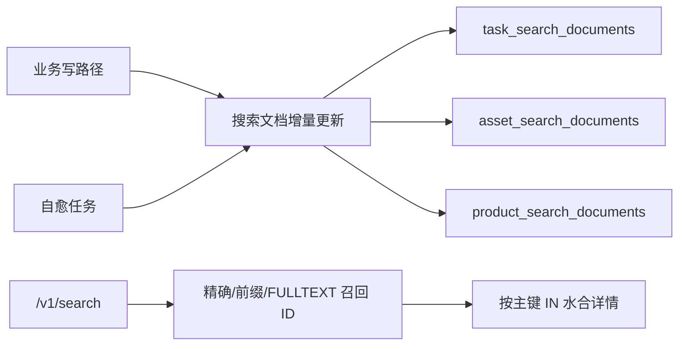

# 运营系统接口与检索查询性能分析报告

日期: 2026-07-08

范围: main-ops 后端接口性能分析。后端代码位于仓库根目录; 前端入口位于 `vue/src/main.ts`, 本次只做后端接口、SQL 与缓存方案分析, 不改产品代码、不执行迁移、不写生产数据。

## 1. 结论摘要

本轮只读取证确认: 当前性能风险不是单点慢 SQL, 而是几个读路径共同依赖了不可索引表达式、宽 JOIN、逐行相关子查询和实时聚合。

最高优先级问题如下:

| 优先级 | 模块 | 主要问题 | 生产证据 |
| --- | --- | --- | --- |
| P0 | 产品中心关键词检索 | `erp_product_sync_records` 每行触发组合 SKU `EXISTS` 子查询, 组合关系表已达 139,226 行 | `EXPLAIN ANALYZE` 关键词 COUNT 实测约 905ms, 子查询 loops=2,098 |
| P0 | 资产中心列表/COUNT | COUNT 和列表重复跑 6 表 JOIN; current-version fallback 相关子查询; `ORDER BY COALESCE(uploaded_at, created_at)` 不可直接走索引 | 默认 COUNT 约 38ms, 默认列表约 47ms; digest 中资产 COUNT 148 次累计 rows_examined 1,285,854 |
| P0 | 数据中心 L1 卡片 | `DATE(t.updated_at)=UTC_DATE()` 与事件表相关子查询导致候选任务逐行查事件 | 生产 digest 150 次累计 14.735s, rows_examined 2,120,862; 单次 EXPLAIN 约 184ms |
| P1 | 全局搜索产品路径 | `products.spec_json` 逐行 `JSON_EXTRACT` + `%kw%` | `products` 28,886 行全表扫描, 单次约 41.5ms |
| P1 | 全局搜索资产路径 | `task_assets` 全表扫描 + 多表 LEFT JOIN + 12 个 `%kw%` LIKE | `task_assets` 12,007 行扫描, 单次约 10.7ms |
| P1 | 数据中心 module dwell | 多段 start/end 事件自连接, 每段按 task_id 回查事件 | 30 天窗口单次约 174ms; 当前 39,214 事件尚可, 但复杂度随事件量快速放大 |
| P2 | 横切面 | `information_schema` 表/列存在性每请求重复查; Redis 已接入但这些读路径基本未用 | Redis `keyspace_hits=6`, `keyspace_misses=9,537,259`; slow log 关闭 |

目标方案总体方向正确: 统一搜索文档层、瘦索引查 ID 后水合、写路径增量维护、读模型自愈、报表预聚合/缓存, 都与当前代码问题匹配。需要校正的点有三个:

1. 目标文件写 `/v1/search p95 < 500ms`, 但当前既有测试 `service/search/sa_d_i11_search_p95_performance_integration_test.go` 的硬阈值是 `< 1s`; 500ms 应作为新目标, 不是现有护栏。
2. 目标文件建议的迁移编号 `114` 到 `118` 目前可用, 因为当前最大迁移是 `113_external_asset_source_modified_at.sql`; 真正开发前仍需再次以 `db/migrations` 现状确认。
3. P2a 中 `ASSET_SEARCH_LEGACY_CURRENT_VERSION` 兼容开关可以作为上线保险, 但长期应删除; 当前生产 `design_assets.current_version_id` 已覆盖 11,621 / 11,943, 只剩 322 条为空, 适合先治理数据不变量。

## 2. 权威合同与路由边界

本次只分析 shared-backend 的 main-ops 接口, 不触碰 asset-workbench。

权威来源:

- 路由存在性: `transport/http.go`
- API 字段合同: `docs/api/openapi.yaml`
- V1 权威索引: `docs/V1_BACKEND_SOURCE_OF_TRUTH.md`
- 全局搜索/报表菜单语义: `docs/V1_INFORMATION_ARCHITECTURE.md`
- 资产中心语义: `docs/V1_ASSET_OWNERSHIP.md`

覆盖的主要 route family:

| 模块 | 路由 | 入口 | 数据层 |
| --- | --- | --- | --- |
| 全局搜索 | `GET /v1/search` | `transport/handler/search.go` -> `service/search/service.go` | `repo/mysql/search_repo.go` |
| 资产中心 | `GET /v1/assets`, `GET /v1/assets/search`, `POST /v1/assets/search/batch`, 下载/详情路由 | `transport/handler/task_asset_center.go` -> `service/asset_center/*` | `repo/mysql/task_asset_search_repo.go`, `repo/mysql/external_asset_repo.go` |
| 产品中心 | `GET /v1/product-management`, `GET /v1/product-management/combo-tree`, `GET /v1/product-management/cost-dashboard` | `transport/handler/product_management.go` -> `service/product_management_service.go` | `repo/mysql/product_management.go` |
| 产品搜索 | `GET /v1/products/search` 和全局搜索 products 分支 | `transport/handler/product.go`, `service/search` | `repo/mysql/product.go`, `repo/mysql/search_repo.go` |
| 数据中心 | `GET /v1/reports/l1/cards`, `/throughput`, `/module-dwell` | `transport/handler/report_l1.go` -> `service/report_l1/service.go` | `repo/mysql/report_l1_repo.go` |

## 3. 生产取证摘要

取证位置: `jst_ecs`, 数据库 `jst_erp`, MySQL 8.0.45, `performance_schema=ON`。所有 SQL 均为 `SELECT` / `SHOW` / `EXPLAIN ANALYZE`, 未执行写操作。

### 3.1 核心表规模

| 表 | 精确行数 | 备注 |
| --- | ---: | --- |
| `omp_sku_combo_relations` | 139,226 | 产品中心关键词检索的组合 SKU 子查询主要放大源 |
| `omp_sku_combo_records` | 26,670 | 组合 SKU 名称/短名参与 LIKE |
| `task_event_logs` | 39,214 | L1 报表主要事件源 |
| `products` | 28,886 | 全局产品搜索逐行 JSON 解析 |
| `task_assets` | 12,007 | 资产中心和全局资产搜索主表 |
| `design_assets` | 11,943 | current version 锚点表 |
| `task_modules` | 6,498 | 资产中心 owner team 过滤/展示 |
| `omp_sku_erp_trace_logs` | 3,046 | 成本看板最新 ERP trace 相关子查询 |
| `omp_sku_cost_snapshots` | 2,721 | 产品中心 cost snapshot 相关子查询 |
| `erp_product_sync_records` | 2,099 | 产品中心列表/看板主表 |
| `tasks` | 1,686 | 全局搜索、报表、任务列表 |
| `task_search_documents` | 1,686 | 已有任务搜索读模型 |
| `users` | 145 | 全局搜索 users 分支 |

### 3.2 关键索引现状

| 表 | 已有关键索引 | 缺口 |
| --- | --- | --- |
| `task_search_documents` | `PRIMARY(task_id)`, `FULLTEXT(search_text)`, `idx_task_search_updated(updated_at, task_id)`, `idx_task_search_iid(product_i_id)` | LIKE fallback 仍可绕开 FULLTEXT; 表存在性每请求查 `information_schema` |
| `task_assets` | `idx_task_assets_asset_id(asset_id)`, `idx_task_assets_asset_version_no(asset_id, asset_version_no)`, `idx_task_assets_archived_deleted(is_archived, deleted_at)` | 缺 `asset_id, asset_version_no DESC, id DESC`; 缺 `sort_time` 或等效排序索引; LIKE 条件无全文索引 |
| `design_assets` | `idx_design_assets_current_version_id(current_version_id)`, `idx_design_assets_task_id(task_id)` | `current_version_id` 仍有 322 条 NULL, 导致 fallback 子查询存在 |
| `products` | `idx_products_sku_code(sku_code)`, `idx_products_category(category)` | 没有 `spec_json->$.i_id` 生成列索引; 没有产品搜索全文索引 |
| `erp_product_sync_records` | sku/iid/status/task/task_created 等单列索引 | 缺列表排序复合索引; 缺组合搜索文本/全文索引; 缺 latest cost/trace 物化指针 |
| `task_event_logs` | `idx_task_event_logs_event_type(event_type)`, `idx_task_event_logs_task_id(task_id)`, `uq_task_event_logs_task_seq(task_id, sequence)` | 缺 `(event_type, created_at, task_id)` 或 `(task_id, event_type, created_at)` 组合索引 |

### 3.3 慢语句 digest 与连接状态

| 指标 | 证据 |
| --- | --- |
| 慢日志 | `slow_query_log=OFF`, `long_query_time=10s`; 当前主要依赖 `performance_schema` |
| MySQL 连接 | `max_connections=151`, `Threads_connected=14`, `Threads_running=2`, `Max_used_connections=29` |
| 全局 full scan 信号 | `Select_scan=44,470,783`, `Select_full_join=25,994,670`, `Handler_read_rnd_next=78,667,223,274` |
| Redis | `connected_clients=3`, `used_memory_human=1.15M`, `keyspace_hits=6`, `keyspace_misses=9,537,259`, `evicted_keys=0` |

重要 digest:

- 任务列表 COUNT 读路径累计最突出: `SELECT COUNT(*) FROM tasks ... LEFT JOIN ... task_assets GROUP BY task_id`, `COUNT_STAR=19,956`, `sum_sec=161.488`, `SUM_ROWS_EXAMINED=42,621,845`。这不在四个主模块中, 但属于横切面任务列表检索风险。
- L1 cards 今日完成: `COUNT(DISTINCT t.id)` + `DATE(t.updated_at)` + `EXISTS task_event_logs`, `COUNT_STAR=150`, `sum_sec=14.735`, `avg_ms=98.233`, `SUM_ROWS_EXAMINED=2,120,862`。
- 产品成本 trend: `DATE(cost_snapshot.created_at)` + JSON 判断, `COUNT_STAR=65`, `sum_sec=1.842`, `avg_ms=28.337`, `SUM_ROWS_EXAMINED=994,781`。
- 资产中心 COUNT: 相关子查询 current version 形态出现在 digest, `COUNT_STAR=148`, `sum_sec=0.759`, `avg_ms=5.131`, `SUM_ROWS_EXAMINED=1,285,854`。
- 产品中心 read model refresh 是总耗时 Top, 但属于后台写入路径, 不应混同为本次接口读路径; 后续可另做 refresh 性能治理。

## 4. 分模块分析

### 4.1 全局搜索 `/v1/search`

调用链:

`transport/handler/search.go` -> `service/search/service.go` -> `repo/mysql/search_repo.go`。

`scope=all` 会并发 5 路:

- tasks: `SearchTasks`
- system assets: `SearchAssets`
- external assets: `searchExternalAssets`
- products: `SearchProducts`
- users: 仅 SuperAdmin/HRAdmin 执行 `SearchUsers`, 其余角色直接返回空数组

现状:

- 并发 fan-out 能隐藏部分单路延迟, 但没有单请求整体 timeout/子查询 timeout; 任意一路慢查询仍会占连接。
- tasks 已有 `task_search_documents` FULLTEXT 主路径, 但仍保留 `search_text LIKE '%kw%'` fallback。
- assets 仍是 `task_assets` + `design_assets` + `tasks` + users 多表 JOIN, 12 个前导通配 LIKE。
- products 直接查 `products`, 对 `spec_json` 每行 `JSON_EXTRACT`。
- users 只有 145 行, 当前不是主要瓶颈。

生产 EXPLAIN:

| 分支 | 查询样例 | 结果 |
| --- | --- | --- |
| tasks LIKE fallback | `task_search_documents.search_text LIKE '%常规kt板%'` | 走 `idx_task_search_updated` 反向索引扫描, 实测约 4.44ms; 当前表 1,686 行尚小, 但本质不是文本索引 |
| assets | 12 个 `%png%` LIKE + current-version fallback | `task_assets` 表扫描 12,007 行, 排序后 JOIN; 实测约 10.7ms |
| products | `CGK000733` 触发 sku/i_id/product/category/JSON OR | `products` 全表扫描 28,886 行, 逐行 JSON; 实测约 41.5ms |

根因:

- 全局搜索没有统一索引层, tasks 有读模型但 assets/products 仍回源 JOIN。
- products 的 `i_id` 存在 JSON 中, 没有生成列物化。
- `%kw%` 前导通配和 `COALESCE/JSON_EXTRACT` 包裹列, 使普通 BTree 索引不可用。

优化方向:

1. 保留 `task_search_documents` 模式, 扩展 `asset_search_documents` 和 `product_search_documents`。
2. 查询路径改为精确匹配、前缀匹配、FULLTEXT/ngram 三段 UNION, 只返回 ID 和排序字段。
3. 详情字段按 ID `IN (...)` 回源水合, 不在搜索阶段做宽 JOIN。
4. 删除任务 LONGTEXT LIKE fallback; 读模型缺失改为健康检查/自愈任务, 不让线上请求退化为全表 LIKE。
5. `tableExists` / `mysqlColumnExists` 使用进程内缓存, 消除每请求 `information_schema`。

### 4.2 资产中心

调用链:

`transport/handler/task_asset_center.go` -> `service/asset_center/search.go` -> `repo/mysql/task_asset_search_repo.go`。

现状:

- `GET /v1/assets/search` 默认先执行 COUNT, 再执行列表查询。
- COUNT 与列表都基于同一个 6 表 JOIN: `task_assets`, `design_assets`, `tasks`, `task_modules`, `users` x3。
- WHERE 中使用:

```sql
ta.id = COALESCE(da.current_version_id, (
  SELECT ta2.id
  FROM task_assets ta2
  WHERE ta2.asset_id = da.id
  ORDER BY ta2.asset_version_no DESC, ta2.id DESC
  LIMIT 1
))
```

- 排序使用 `ORDER BY COALESCE(ta.uploaded_at, ta.created_at) DESC, ta.id DESC`。
- 关键词过滤使用 `LIKE '%kw%'`; 格式过滤使用 `LOWER(file_name)` / `LOWER(mime_type)`。
- 深分页仍是 `LIMIT offset, size`。

生产数据:

- `design_assets.current_version_id`: 11,621 条非空, 322 条为空。
- 活跃 `task_assets`: 12,007 行; 11,621 行匹配 current version; 386 行为非当前或 current version 缺失。

生产 EXPLAIN:

| 查询 | 结果 |
| --- | --- |
| 默认 COUNT | 扫 `design_assets` 11,943 行; 相关子查询 loops=322; 输出 7,350 行后聚合; 实测约 38.3ms |
| 默认列表 | 同样扫描与 JOIN 7,350 行, 再对 `COALESCE(uploaded_at, created_at)` 排序取 20; 实测约 46.8ms |

根因:

- COUNT 没有瘦身, 展示字段 JOIN 被带入总数计算。
- current-version fallback 还在请求路径执行, 数据不变量没有被强制。
- 排序表达式不可直接用索引。
- 搜索与取数一体, 无法先用窄索引筛 ID。

优化方向:

1. 回填并强制维护 `design_assets.current_version_id`; 将请求路径改为 `ta.id = da.current_version_id`。
2. 短期 COUNT 只保留过滤必需 JOIN, 去掉三路 users 展示 JOIN。
3. 增加生成列或物化列 `sort_time = COALESCE(uploaded_at, created_at)` 并建 `(is_archived, sort_time DESC, id DESC)`。
4. 关键词检索并入 `asset_search_documents`, 列表只按 asset_id 水合。
5. 对深分页设置上限或改游标分页; 对总数使用弱一致缓存。

### 4.3 产品中心

调用链:

`transport/handler/product_management.go` -> `service/product_management_service.go` -> `repo/mysql/product_management.go`。

现状:

- `List` 先 COUNT, 再列表。
- 列表 JOIN `omp_sku_cost_snapshots` 时使用逐行 `ORDER BY ... LIMIT 1` 相关子查询。
- 默认 `issue_scope=attention` 会对 `cost_price/status` 做 OR 过滤。
- 关键词过滤包含组合 SKU `EXISTS`, 对 `omp_sku_combo_relations` / `omp_sku_combo_records` 做逐行关联与 LIKE。
- `CostDashboard` 实时扫描 `erp_product_sync_records`, 同时相关查最新 cost snapshot 与最新 ERP trace, 并逐行 JSON 解析。
- `ListComboTree` 在 service 层可能分页循环收集记录用于分组, 在大数据量下会放大 `List` 成本。

生产 EXPLAIN:

| 查询 | 结果 |
| --- | --- |
| 默认 attention COUNT | 扫 `erp_product_sync_records` 2,099 行, 实测约 2.03ms |
| 默认 attention 列表 | 先扫 2,099 行排序取 20, cost_snapshot 子查询实际 loops=60, 实测约 5.66ms |
| 关键词 `CGK000733` COUNT | 主表 2,099 行全扫; 组合 SKU 相关子查询 loops=2,098, 查 `omp_sku_combo_relations` 和 `omp_sku_combo_records`; 实测约 905ms |
| CostDashboard flags | 主表 2,099 行; cost snapshot 子查询 loops=5,325; ERP trace 子查询 loops=4,925; 实测约 141ms |

根因:

- 组合 SKU 关系表最大, 但关键词逻辑把它放在每条产品记录的相关子查询里。
- 最新 cost snapshot / ERP trace 没有物化指针, 每次读都重新排序挑选。
- dashboard 是实时计算, 没有 Redis TTL 或预聚合。
- JSON 字段在查询时解析。

优化方向:

1. `erp_product_sync_records` 增加 `latest_cost_snapshot_id`, 可选增加 `latest_erp_trace_id`; 写路径/refresh 维护。
2. 组合 SKU 搜索文本预计算到 product-management 读模型, 建 ngram FULLTEXT 或独立搜索文档。
3. 默认列表增加 `(updated_at DESC, task_created_at DESC, id DESC)` 或等效复合索引。
4. CostDashboard 使用 Redis TTL 5 分钟; 成本重算完成后主动失效。
5. `legacy_alias_fallback`, area/spec 异常等 JSON/计算指标在快照写入时物化。

### 4.4 数据中心 L1 报表

调用链:

`transport/handler/report_l1.go` -> `service/report_l1/service.go` -> `repo/mysql/report_l1_repo.go`。

现状:

- OpenAPI 与 V1 IA 固定 L1 报表为 SuperAdmin-only。
- `GetCards` 实时查 tasks 和 task_event_logs。
- `GetThroughput` 用 CTE 扫 tasks 和 task_event_logs, 对日期聚合。
- `GetModuleDwell` 用多段 CTE + start/end 事件自连接 + window rank。
- 当前实现直接查 `task_event_logs`, 与 V1 模块文档中 "v1 直接 query" 一致; 优化需要作为 V1 性能改进方案处理, 不应误写成当前合同已要求预聚合。

生产 EXPLAIN:

| 查询 | 结果 |
| --- | --- |
| cards completed today | `tasks` 全扫 1,686 行; 对 560 个候选任务逐个用 `task_id` 查事件并执行 `DATE(tel.created_at)`; 实测约 184ms |
| throughput 30d | 两次扫 tasks, 两次扫 task_event_logs 目标事件, 临时表去重/聚合; 实测约 20.6ms |
| module dwell 30d | 5 段 normalized_events, 多次按 task_id 回查事件; materialize 2,618 samples; 实测约 174ms |

根因:

- `DATE(col)` 包裹列, 不能利用时间范围索引。
- `task_event_logs` 缺事件类型 + 时间 + task_id 的复合索引。
- dwell 通过 start/end 自连接寻找下一个事件, 在单任务事件增多时近似 O(n^2)。
- 无缓存; Redis 已接入但 L1 report 未使用。

优化方向:

1. 所有 `DATE(col)=UTC_DATE()` 改半开区间: `col >= UTC_DATE() AND col < UTC_DATE() + INTERVAL 1 DAY`。
2. `task_event_logs` 建 `(event_type, created_at, task_id)`; 对按 task_id 找后续事件的 dwell 查询再评估 `(task_id, created_at, event_type)`。
3. `GetCards` TTL 60s; `Throughput` / `ModuleDwell` TTL 10min。
4. `Throughput` 建日聚合表; 当天数据可实时补算。
5. dwell 改窗口函数/单遍事件序列计算, 避免多段自连接。

### 4.5 横切面

1. 任务列表检索不在本次四个主模块内, 但 digest 证明是当前真实高频读成本之一。`repo/mysql/task.go` 中关键词 LIKE、latest asset 派生、COUNT 和列表双跑需要单独拆一期。
2. 每请求 `information_schema.tables` / `information_schema.columns` 用于兼容判断, 包括 `searchRepo.tableExists`, `taskSearchDocumentsTableExists`, `mysqlColumnExists`; 这些结果在进程生命周期内可缓存。
3. DB 连接池生产未显式覆盖 env, 当前代码默认 `MaxOpenConns=25`, `MaxIdleConns=10`, `ConnMaxLifetime=5m`; 生产 MySQL `Max_used_connections=29`, 当前还未被连接数压垮, 但慢查询会占用池。
4. 外部资源搜索已有 ngram/FULLTEXT 迁移与 browse parent 索引, 是可复用样板; 不应把 asset-workbench 路径回退成主系统 LIKE 模式。

## 5. 优化方案

### 5.1 索引层

短期可加法上线的索引/列建议:

| 对象 | 建议 | 目的 | 风险 |
| --- | --- | --- | --- |
| `task_event_logs` | `(event_type, created_at, task_id)` | L1 throughput/cards 先按事件和时间过滤 | 写入成本小幅上升 |
| `task_event_logs` | 评估 `(task_id, created_at, event_type)` | dwell 查同一任务后续事件 | 与现有 `uq_task_event_logs_task_seq` 职责不同, 需 EXPLAIN 定稿 |
| `task_assets` | `(asset_id, asset_version_no DESC, id DESC)` | current-version fallback/历史版本排序 | 加法索引 |
| `task_assets` | `sort_time` 生成列或物化列 + `(is_archived, sort_time DESC, id DESC)` | 资产中心默认列表排序 | 生成列表达式需 MySQL 8 验证 |
| `products` | `i_id_gen` 生成列 + index | 消除 `spec_json->$.i_id` 逐行解析 | 需确认 JSON 路径覆盖所有来源 |
| `erp_product_sync_records` | `(updated_at DESC, task_created_at DESC, id DESC)` | 产品列表默认排序 | 加法索引 |
| `erp_product_sync_records` | ngram FULLTEXT 搜索列 | 产品中心关键词/组合 SKU 搜索 | 需先设计搜索文本维护 |

迁移编号建议从 `114` 开始, 但实施前必须再次检查 `db/migrations` 最大编号。

### 5.2 查询改写层

1. 资产中心:
   - 先回填 `design_assets.current_version_id`, 然后主路径改 `ta.id = da.current_version_id`。
   - COUNT 查询拆成瘦查询, 不 JOIN users 展示表。
   - 默认排序改用 `sort_time`。

2. 产品中心:
   - `productManagementCostTraceJoin` 改为 `latest_cost_snapshot_id` 直连。
   - 组合 SKU `EXISTS` 改为预计算搜索列或独立倒排表。
   - CostDashboard 的 latest ERP trace 改物化指针或缓存。

3. 数据中心:
   - `DATE()` 条件全部改半开区间。
   - Throughput 从实时 CTE 改聚合表或至少缓存。
   - Dwell 改为事件序列窗口计算。

4. 全局搜索:
   - assets/products 不再在搜索阶段做宽 JOIN。
   - tasks 删除 LIKE fallback, 改 FULLTEXT/ngram 或索引自愈。

### 5.3 读模型/缓存层

推荐统一搜索读模型:



原则:

- 搜索路径只查瘦文档表。
- 详情水合按 ID 批量回源。
- 写路径增量更新, 全量 refresh 只做恢复。
- 定时自愈校验源表和文档表 `updated_at` 漂移。
- MiniMax 只进入异步富化, 不进入同步搜索路径。

缓存建议:

| 接口 | 缓存 |
| --- | --- |
| `/v1/reports/l1/cards` | Redis TTL 60s |
| `/v1/reports/l1/throughput` | Redis TTL 10min, key 含 from/to/department/task_type |
| `/v1/reports/l1/module-dwell` | Redis TTL 10min |
| `/v1/product-management/cost-dashboard` | Redis TTL 5min, 成本重算/refresh 后失效 |
| 资产中心 total | 可选短 TTL 或延迟精确总数 |

### 5.4 应用层

1. 对搜索、资产列表、产品列表、报表接口增加 per-query timeout, 默认 3s; 注意不能只设 HTTP timeout。
2. 对 `limit/page_size` 保持上限, 对深分页增加产品限制或 cursor。
3. 对 `tableExists` / `mysqlColumnExists` 加进程内缓存。
4. 对 `scope=all` 的五路并发记录分支耗时, 便于上线后判定真正瓶颈。
5. 慢查询日志不建议直接在生产无计划开启; 可先用 performance_schema digest + 应用埋点, 需要慢日志时先限定窗口。

## 6. 分期路线图

### P0: 取证与方案冻结, 已完成本轮文档

已完成:

- jst_ecs 生产只读采集表规模、索引、digest、连接状态、Redis 状态。
- 对全局搜索、资产中心、产品中心、数据中心关键 SQL 跑 `EXPLAIN ANALYZE`。
- 静态梳理 handler -> service -> repo -> SQL 调用链。
- 本地 p95 集成测试尝试运行, 但 `MYSQL_DSN not set`, 测试被安全跳过, 未形成本地基线值。

未完成:

- 没有开启慢日志。
- 没有建立 `_r3_test` 本地/测试库 p95 基线。

### P1: 索引速赢与低风险查询改写

建议工作:

- 新增 `task_event_logs(event_type, created_at, task_id)`。
- 新增 `task_assets(asset_id, asset_version_no DESC, id DESC)`。
- 为 `products` 增 `i_id_gen` 生成列和索引, 查询改走生成列。
- `GetCards` 改半开区间。
- `tableExists` / `mysqlColumnExists` 进程缓存。
- 关键读接口增加 context timeout。

验收:

- `./scripts/agent-check.sh`
- OpenAPI 不变。
- 上线前后对比 digest: L1 cards rows_examined 和 avg_ms 明显下降。

### P2a: 资产中心查询重构

建议工作:

- 回填并维护 `design_assets.current_version_id`。
- 去掉主路径 current-version fallback。
- COUNT 瘦身。
- 排序改 `sort_time`。
- 资产中心搜索逐步接入 `asset_search_documents`。

验收:

- `repo/mysql/task_asset_search_repo_test.go`
- 生产 EXPLAIN: 默认列表不再扫全量 current version 候选后排序。

### P2b: 产品中心查询重构

建议工作:

- `latest_cost_snapshot_id` / 可选 `latest_erp_trace_id` 物化。
- 组合 SKU 搜索文本预计算。
- 默认排序复合索引。
- CostDashboard Redis TTL。

验收:

- `repo/mysql/product_management_test.go`
- 关键词 COUNT 从 905ms 级降到索引/全文召回级。

### P3: 统一搜索文档层

建议工作:

- 新建 `asset_search_documents`, `product_search_documents`。
- 增量 reindex + 自愈工具。
- `/v1/search` assets/products 改瘦索引召回 + ID 水合。
- 移除任务 LIKE fallback。

验收:

- `go test -tags=integration ./service/search -run 'TestSADI(1|2|3|4|5|11)' -count=1` 在 `_r3_test` 库执行。
- 新目标 p95 < 500ms; 现有硬护栏 < 1s 必须继续通过。

### P4: 数据中心预聚合与缓存

建议工作:

- L1 cards/throughput/module-dwell Redis TTL。
- throughput 日聚合表。
- module dwell 单遍窗口重写。

验收:

- `go test -tags=integration ./service/report_l1 -count=1`
- 缓存命中 p95 < 50ms, 未命中 < 1s。

### P5: MiniMax 语义增强, 可选

前提:

- 现有 `service/aiagent/anthropic_compatible.go` 是 MiniMax-M3 对话接口, 有限流和秒级延迟, 不能进同步搜索路径。

建议:

- 近期只做异步同义词/品类归一化富化, 写入搜索文档 `semantic_text`。
- 中期再评估 embedding 端点和向量重排。
- 远期自然语言搜索做显式异步入口。

## 7. 验证与上线建议

开发每期都保持 API 契约不变、前端零改动。任何 Go struct JSON 字段变化都必须同步 OpenAPI; 本方案本身不要求字段变化。

建议上线验证:

1. 上线前保存 digest 快照:

```sql
SELECT DIGEST_TEXT, COUNT_STAR, SUM_TIMER_WAIT, SUM_ROWS_EXAMINED, SUM_ROWS_SENT
FROM performance_schema.events_statements_summary_by_digest
WHERE SCHEMA_NAME = DATABASE()
ORDER BY SUM_TIMER_WAIT DESC
LIMIT 50;
```

2. 上线后 30-60 分钟再取一次同类 digest, 对比目标 digest 的 `avg_ms` 和 `rows_examined / count_star`。
3. 对每个改写 SQL 保留 `EXPLAIN ANALYZE` 前后对照。
4. 后端默认 gate: `./scripts/agent-check.sh`。
5. 涉及 OpenAPI 时运行 `python scripts/docs/generate_frontend_docs.py`。
6. 生产 deploy/publish 只在明确授权后执行。

## 8. 风险与待确认

- P1 增加索引是加法变更, 但 `task_event_logs` 和 `task_assets` 写入频繁, 需要评估写入延迟和磁盘空间。
- `products.i_id_gen` 的 JSON 路径需要覆盖 `spec_json` 中现存多形态数据; 本轮只确认当前查询使用 `$.i_id`。
- 资产中心 current-version 不变量还有 322 条 NULL, 需要先做回填和写路径审计。
- 产品中心组合 SKU 搜索不能只加普通索引, 因为 `rec.name LIKE '%kw%'` 和 `rec.short_name LIKE '%kw%'` 仍不可索引; 应优先读模型/全文。
- Redis 当前几乎没有有效命中, 引入缓存后必须统一 key 规范与失效策略。
- `_r3_test` 本地/测试库未在当前环境配置, 本轮没有获得真实 p95 基线数值。
